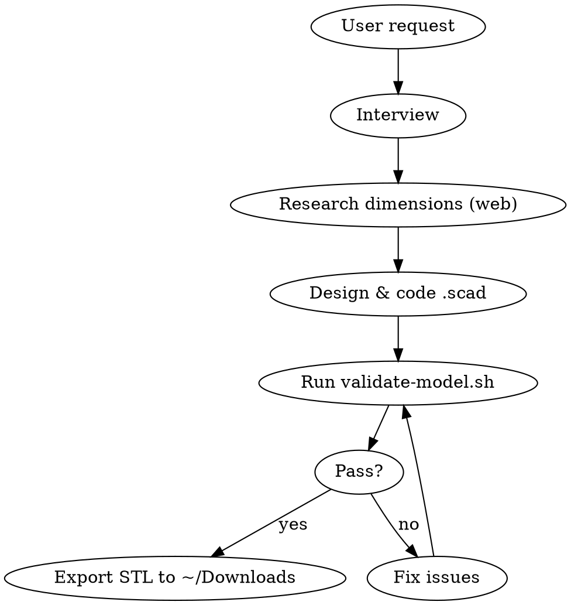

# Printable 3D Model with OpenSCAD

## Overview

Guide the user from idea to validated, print-ready STL. Workflow: **Interview → Design → Code → Validate → Export**.

All models are parametric OpenSCAD scripts. All dimensions in mm. Every model must pass `validate-model.sh` before delivery.

## Workflow



## Interview Checklist

Ask these BEFORE writing any code. Use AskUserQuestion for structured input.

1. **What is the object?** Physical description, purpose, how it will be used
2. **Dimensions** — all critical measurements. If unknown, WebSearch for product specs (check printables.com, dimensions.com, manufacturer sites)
3. **Fit requirements** — what fits into what? Snug, loose, or press-fit?
4. **Material** — PLA, PETG, ABS, TPU? (suggest based on use case, see table below)
5. **Printer specs** — nozzle diameter (default 0.4mm), bed size, layer height (default 0.2mm)
6. **Print orientation** — which face on the bed? (suggest largest flat surface)
7. **Supports** — design to avoid if possible; ask if user accepts supports
8. **Cutouts/holes** — cable passages, mounting holes, ventilation?

## Material Guide

| Material | Best for | Snug tol. | Loose tol. | Press-fit | Nozzle °C | Bed °C | Shrinkage | Heat limit |
|----------|----------|-----------|------------|-----------|-----------|--------|-----------|------------|
| **PLA** | Prototypes, displays, low-stress | 0.3-0.4mm | 0.5mm | 0.1mm | 190-220 | 50-60 | Low | 60°C |
| **PETG** | Functional parts, outdoor | 0.3mm | 0.5mm | 0.15mm | 220-250 | 70-80 | Low-Med | 80°C |
| **ABS** | Mechanical, heat-resistant | 0.4mm | 0.6mm | 0.2mm | 230-250 | 90-110 | Med-High | 105°C |
| **TPU** | Flexible, impact-absorbing | 0.5mm | 0.7mm | N/A | 210-230 | 60 | Low | 80°C |

**Suggest PLA** unless: part sees heat (→PETG/ABS), needs flexibility (→TPU), or is mechanical/outdoor (→PETG).

For materials not listed, WebSearch: `"[material] 3D printing tolerance temperature settings"`

## Design Rules (Hard Requirements)

Every model MUST follow these. Violations cause print failures.

| Rule | Value | Why |
|------|-------|-----|
| Min wall thickness | 1.2mm | 3 perimeters × 0.4mm nozzle |
| Max overhang | 45° from vertical | Beyond this needs supports |
| Max bridge span | 10mm | Longer spans sag |
| Min hole diameter | 2mm | Smaller holes close up |
| Diameter jump transition | 45° cone if jump > 10mm | Prevents floating layers in slicer |
| Flat base surface | Required | Bed adhesion |
| Bottom edge fillets | 1-2mm radius | Bed adhesion + stress reduction |
| All exposed edge fillets | 1mm radius | Comfort + print quality |
| Vertical dims | Multiples of 0.2mm (layer height) | Dimensional accuracy |
| Min standalone feature | 2mm width | Thin walls break |
| Boolean overlaps | ≥0.5mm | Prevents coincident surface artifacts |

## OpenSCAD Code Patterns

### File Template

```openscad
// === [Model Name] ===
// All dimensions in mm
// Material: [PLA/PETG/ABS]
// Print orientation: [description]

$fn = $preview ? 32 : 64;

// --- Tolerances ---
tolerance = 0.4;  // per side — adjust per material table

// --- [Component] dimensions ---
// group related params with comments noting source measurements

// --- Derived ---
// computed values from above params

// === Modules ===

// === Assembly ===
module assembly() {
    difference() {
        union() {
            // ALL solid geometry here
        }
        // ALL cavities/holes here (cut from full assembly)
        // Flatten base
        translate([0, 0, -500]) cube([1000, 1000, 1000], center = true);
    }
}

assembly();
```

### Critical: Assembly-Level Cavity Cuts

**NEVER pre-hollow parts before union.** When you union a hollowed ring with a solid stem, the stem fills the cavity back in.

```openscad
// ❌ WRONG: cavity gets filled by stem union
module ring() {
    difference() {
        cylinder(h = 10, d = 100);
        cylinder(h = 11, d = 94);  // hollow
    }
}
union() { ring(); stem(); }  // stem fills cavity!

// ✅ CORRECT: hollow at assembly level
difference() {
    union() {
        cylinder(h = 10, d = 100);  // solid ring
        stem();
    }
    cylinder(h = 11, d = 94);  // cavity cut AFTER union
}
```

### Fillet Helpers

```openscad
fillet_r = 1.0;

// Round outer convex edge of cylinder (subtract from model)
module outer_fillet(d, z, r) {
    translate([0, 0, z - r])
        rotate_extrude()
            translate([d / 2 - r, 0])
                difference() {
                    square(r + 0.01);
                    circle(r = r);
                }
}

// Round inner lip edge of cylinder (subtract from model)
module inner_fillet(d, z, r) {
    translate([0, 0, z - r])
        rotate_extrude()
            translate([d / 2, 0])
                difference() {
                    square([r + 0.01, r + 0.01]);
                    translate([r, 0]) circle(r = r);
                }
}

// Fill concave inner corner (add to model via union)
module concave_fillet(d, z, r) {
    translate([0, 0, z - r])
        rotate_extrude()
            translate([d / 2, 0])
                difference() {
                    square(r);
                    translate([r, r]) circle(r = r);
                }
}

// Rounded rectangular through-hole
module rounded_hole(w, h, d, r) {
    hull() {
        for (x = [r, w - r])
            for (z = [r, h - r])
                translate([x, 0, z])
                    rotate([-90, 0, 0])
                        cylinder(h = d, r = r);
    }
}
```

### Radial Hole Through Curved Wall

Axis-aligned cubes create slanted cuts through curved walls. Use radial rotation:

```openscad
hole_angle = asin(hole_x_offset / (outer_dia / 2));
rotate([0, 0, hole_angle])
    translate([-hole_w / 2, -(outer_dia / 2 + 1), 0])
        rounded_hole(hole_w, hole_h, wall + 4, fillet_r);
```

### Undersized Hole Compensation

OpenSCAD inscribes polygons in circles, making holes smaller than specified:

```openscad
// Compensated radius for accurate holes
comp_r = desired_r / cos(180 / $fn);
```

At $fn=64, the error is ~0.04% (negligible). At $fn=32, it's ~0.15%. Apply compensation only when tight tolerances matter.

### Z=0 Base Cut

When tilting geometry, parts extend below z=0. Cut flush:

```openscad
// ✅ CORRECT: cube top face at exactly z=0
translate([0, 0, -500]) cube([1000, 1000, 1000], center = true);

// ❌ WRONG: leaves 1mm gap (cube goes to z=-1, not z=0)
translate([0, 0, -501]) cube([1000, 1000, 1000], center = true);
```

## Pitfalls (Learned from Real Prints)

| Mistake | Symptom | Fix |
|---------|---------|-----|
| Pre-hollowed parts in union | Cavity filled by other solid | Cut cavities at assembly level |
| Coincident surfaces in union | Non-manifold edges, slicer warnings | Overlap shapes by ≥0.5mm |
| Separate gusset hull + stem | 4+ faces per edge at tangent line | Build taper into the stem itself |
| Axis-aligned cut on curved wall | Slanted hole, connector won't fit | Radial cut with `rotate([0,0,asin(...)])` |
| Variable used before defined | `WARNING: unknown variable` | OpenSCAD top-level evaluates in order — define dependencies first |
| ASCII STL export | Slicer parsing issues | Always `--export-format binstl` |
| Stem-to-cup diameter jump | Slicer "floating regions" | Add 45° transition cone |
| Cable channel groove on stem | Weakened wall, visible artifact | Route cables externally instead |
| Tolerance too tight (0.2mm PLA) | Parts need force to fit | Use 0.3-0.4mm for PLA snug fit |
| Ring height < component thickness | Component sticks out, holes misaligned | Measure actual component, add ledge + clearance |

## Validation & Export

After writing the .scad file, ALWAYS validate before delivering:

```bash
# Run the validation script (must be executable)
${CLAUDE_PLUGIN_ROOT}/skills/printable/scripts/validate-model.sh model.scad

# Or manually:
openscad -o model.stl --export-format binstl model.scad 2>&1  # check for warnings
admesh model.stl  # check: parts=1, disconnected=0, degenerate=0
```

If `admesh` is not installed: `brew install admesh` (macOS) or `apt install admesh` (Linux).

Copy validated STL to `~/Downloads` for user access.

## Web Resources

Query these when you need more information:

**Product dimensions** (when user doesn't have measurements):
- WebSearch: `"[product name] dimensions mm"` or check `dimensions.com`, `printables.com`
- Check manufacturer spec sheets

**OpenSCAD syntax** (beyond the inline reference):
- `https://en.wikibooks.org/wiki/OpenSCAD_User_Manual/The_OpenSCAD_Language`
- `https://en.wikibooks.org/wiki/OpenSCAD_User_Manual/Primitive_Solids`
- `https://en.wikibooks.org/wiki/OpenSCAD_User_Manual/Transformations`
- `https://en.wikibooks.org/wiki/OpenSCAD_User_Manual/Using_the_2D_Subsystem`
- See `openscad-reference.md` in this skill directory for full offline reference

**Material properties** (for materials not in the table):
- `https://www.simplify3d.com/resources/materials-guide/properties-table/`
- `https://www.matterhackers.com/3d-printer-filament-compare`
- `https://ultimaker.com/learn/petg-vs-pla-vs-abs-3d-printing-strength-comparison/`

**Design rules & tolerances**:
- `https://www.hydraresearch3d.com/design-rules`
- `https://hackaday.com/2025/08/04/how-to-design-3d-printed-parts-with-tolerance-in-mind/`
- `https://jlc3dp.com/help/article/3D-Printing-Design-Guideline`

**Community models** (for reference designs):
- `https://www.printables.com` — Search for similar designs with known dimensions
- `https://www.thingiverse.com` — Community 3D models
